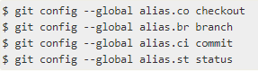

# Создание псевдонимов с помощью команды git config

Команда __git config__ отлично подходит для быстрого создания псевдонимов.
Мы хотим представить функцию, которая может сделать вашу работу с Git проще, понятнее и привычнее: псевдонимы.

Git не выводит автоматически вашу команду, если вы вводите ее частично. Если вы не хотите вводить весь текст каждой из команд Git, вы можете легко настроить псевдоним для каждой команды с помощью git config.

Вот пара примеров, которые вы, возможно, захотите настроить:



Это означает, что, например, вместо ввода git commit вам просто нужно ввести git ci.

Продолжая использовать Git, вы, вероятно, будете часто использовать и другие команды; 

Не стесняйтесь создавать новые псевдонимы.

Этот метод также может быть очень полезен при создании команд, которые, по вашему мнению, должны существовать.

Код для настройки привычных сокращений

```
git config --global alias.cfg config
git cfg --global alias.co checkout
git cfg --global alias.br branch
git cfg --global alias.ci commit
git cfg --global alias.st status
git cfg --global alias.lol "log --oneline --graph"
```

